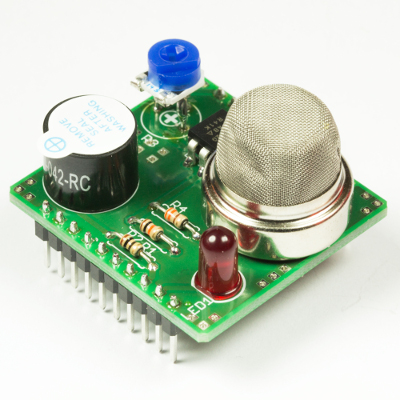

💾 Gas Sensor Childboard
========================

# 📸 Image

# 📂 Description

The LXRobotics Gas Sensor Childboard can be used to sense various gas types e.g. LPG, butane, propane, methane, alcohol, hydrogen, smoke. The sensitivity of the sensor can be adjusted via potentiometer. A user controllable red LED and a piezo buzzer are used for signalling alarm/warning states. For a quick and easy start, an open source Arduino library with sample programs is available.

**Features**

* MQ-2 gas sensor (LPG, butane, propane, methane, alcohol, hydrogen, smoke)
* Power supply of the gas sensor can be turned off in order to save energy
* Adjustable sensitivity of the gas sensor via potentiometer
* Piezo-buzzer for alarm tones
* Red signal LED
* Can be used with the Radioshield and the Childboard Adaptershield
* Arduino Library with example programs is available on GitHub

# 🎥 [Video](images/gas_sensor_childboard_demo.mp4)
